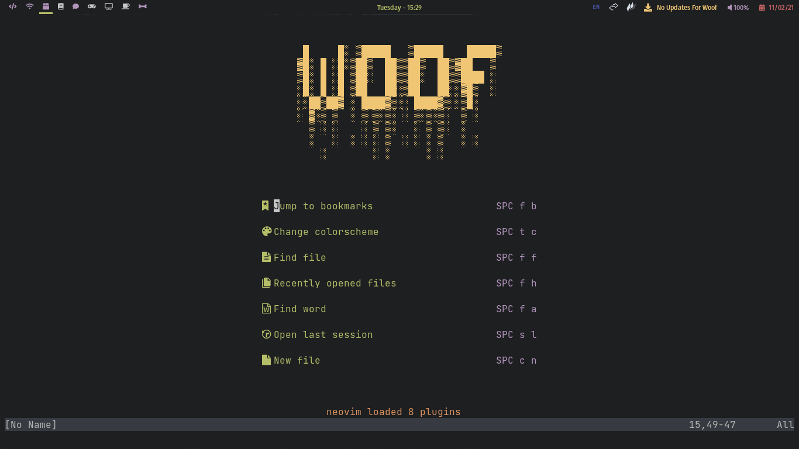
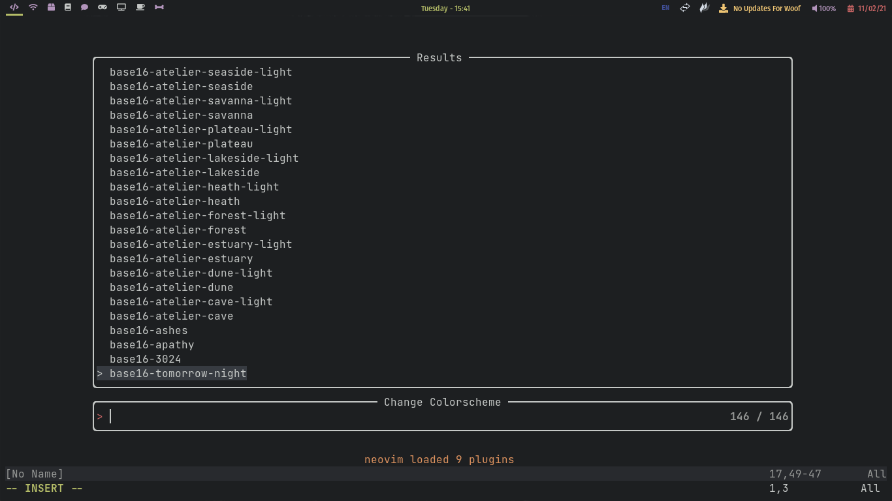
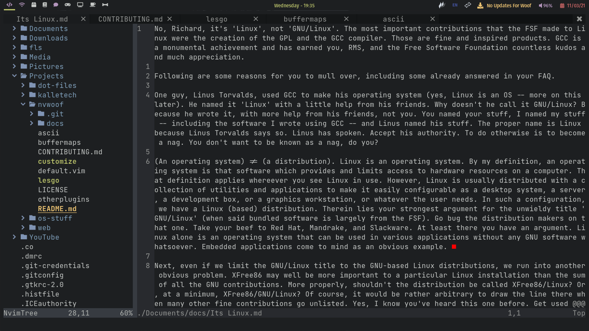
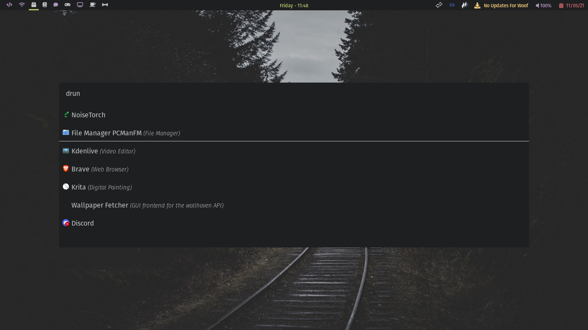
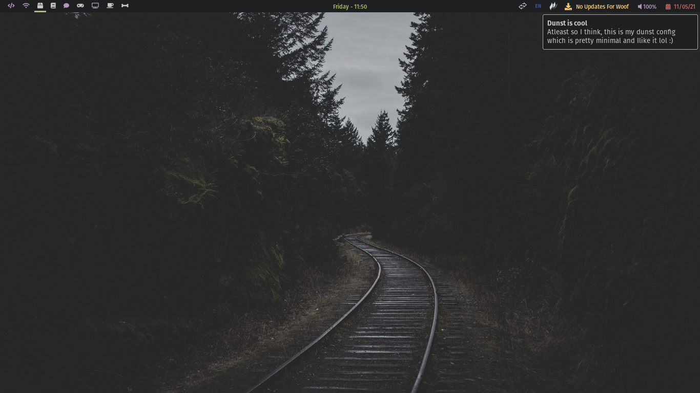

 
  <h1>Woof's Nice Rice</h1>
  https://acutewoof.github.io/dot-files
  

	<h2>Separate Github Repos For The Dotfiles</h2>
	<ul>
		<li><a href="https://github.com/acutewoof/qtile">Qtile</a></li>
		<li><a href="https://github.com/woof-os/nvim">Neovim</a></li>
		<li><a href="https://github.com/woof-os/rofi">Rofi</a></li>
		<li><a href="https://github.com/woof-os/dunst">Dunst</a></li>
		<li><a href="https://github.com/woof-os/kitty">Kitty</a></li>
	</ul>
  

	<h2>Screenshots</h2>
	 
	
	 
        
	 
        
	 
        
	 
	
	 
	
