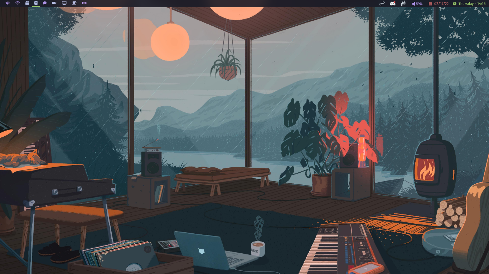
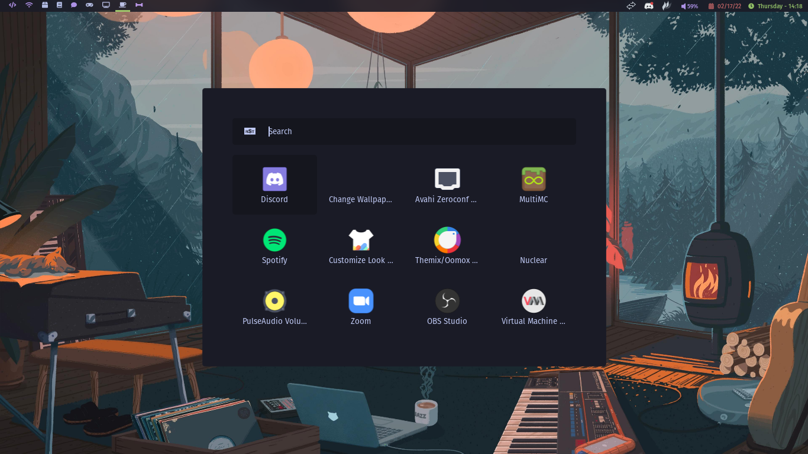
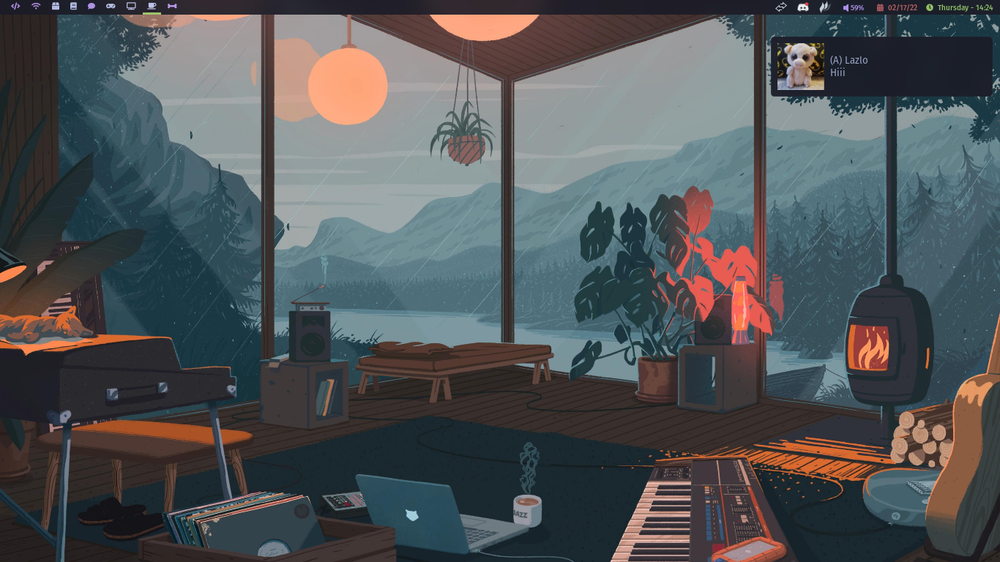
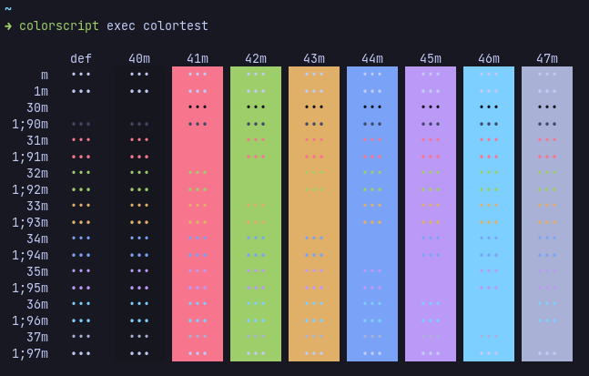

 
 
 

# Screenshots

# Colorscheme (Tokyonight)

# Credits
- Wallpapers from [FrenzyExists](https://github.com/frenzyexists/wallpapers)
- Rofi theme modified from [Joni](https://github.com/joni84/rofi)
